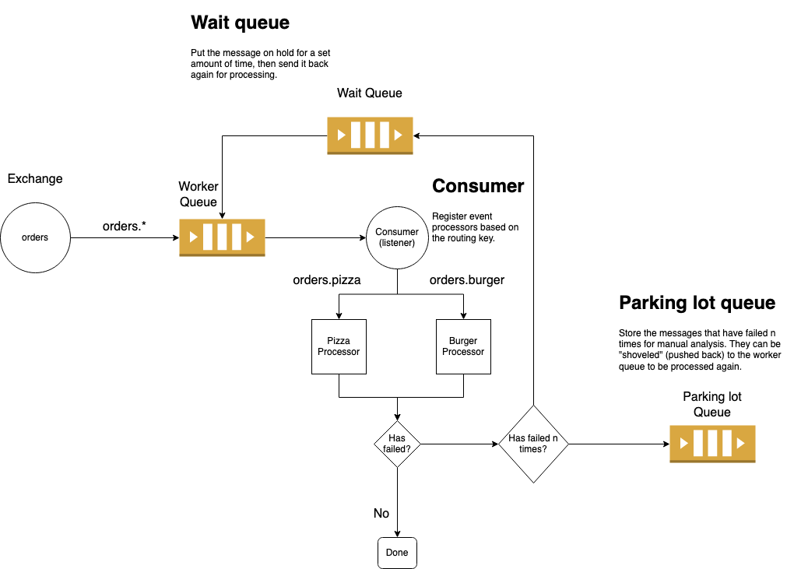

# Spring boot RabbitMQ simplified


Example solution built of Spring boot [RabbitMQ](https://docs.spring.io/spring-boot/docs/current/reference/html/spring-boot-features.html#boot-features-rabbitmq)
that handles failure through addition of dead-letter wait queue and parking lot queue. It provides easy
setup methods and simple event processing with error handling built-in.

With this solution you can easily bootstrap the entire setup of:
 - Topic Exchange
 - Worker Queue
 - Wait Queue
 - Parking lot Queue

With following route based processors:
```text
            /-- orders.burger --> BurgerProcessor 
orders.* -> 
            \-- orders.pizza  --> PizzaProcessor
```
You will not need to worry about runtime exceptions as it's handled by the `TopicProcessor`. 

## Design
The following diagram illustrates a single domain setup, you can have as many of these
as you want, and it's usually per application. 

<p align="center">
  
</p>

## Core
This repository serves as an example with core logic located in `rabbitmq` module. Modules `models`, `orders` and 
`restaurants` serve as examples that implement the core features. To get started check out the [setup](#setup) part. 

Table of contents
=================

<!--ts-->
   * [Requirements](#requirements)
   * [Development](#development)
   * [Setup](#setup)
      * [Update application.yml](#1-spring-boot-rabbitmq-configuration)
      * [Create topic and queue initializer](#2-create-topic-and-queue-initializer)
      * [Register initializer in Spring](#3-register-initializer-in-spring)
      * [Configuration](#4-configuration)
      * [Attaching the listener](#5-attaching-the-listener)
      * [Testing with initializer context](#6-testing-with-initializer-context)
   * [Using event processors](#using-event-processors)
      * [Implementing](#implementing)
      * [Registering](#registering)
<!--te-->

## Requirements
 - Java 11+
 - RabbitMQ 3+
 - Docker and docker-compose (optional)
 
## Development
Start RabbitMQ service via docker:
```bash
docker-compose up -d --build
```

## Setup

### 1. Spring boot RabbitMQ configuration
```yaml
spring:
  rabbitmq:
    username: ${RABBITMQ_USERNAME:guest}
    password: ${RABBITMQ_PASSWORD:guest}
    host: ${RABBITMQ_HOST:localhost}
    port: ${RABBITMQ_PORT:5672}
    listener:
      simple:
        default-requeue-rejected: false
        acknowledge-mode: manual
        prefetch: 50
```
 
### 2. Create the topic and queue initializer
The initializer will dynamically create Exchange, Queues and Bindings beans at the application
start and connect them. The TopicConfig is also provided through `ITopicConfig` interface.
```java
public class OrdersTopicInitializer implements ApplicationContextInitializer<GenericApplicationContext> {
  @Override
  public void initialize(GenericApplicationContext context) {
    var config = new TopicConfig.Builder("orders")
      .withWaitQueueTtlSeconds(5)
      .build();
    TopicBeansInitializer.setContextBeans(context, config);
  }
}
```
Configuration `config` will build a default configuration based on the exchange name `orders`
if not altered, and the resulting names will be:
 - Exchange: `orders`
 - Worker queue: `orders-queue`
 - Wait queue: `orders-queue.wait`
 - Parking lot queue: `orders-queue.parking-lot`

### 3. Register initializer in Spring
Here we add initializer logic to Spring on start-up, so that required beans are set in application context. Because
of this, if our tests use any RabbitMQ logic we will need to add this 
[initializer context in our tests](#6-testing-with-initializer-context) as well.
```java
@SpringBootApplication
public class SpringApp {
  public static void main(String[] args) {
    new SpringApplicationBuilder()
      .sources(SpringApp.class)
      .initializers(new OrdersTopicInitializer())
      .run(args);
  }
}
```
### 4. Configuration
   
First configuration is required to avoid circular dependency, you can
place the RabbitClient wherever you like as long as it is not the next
beans configuration class. 

`RabbitClient` is a simple wrapper for the RabbitTemplate and does a simple conversion of an object to
raw json.
```java
@Configuration
public class Config {
  @Bean
  RabbitClient rabbitClient(ObjectMapper objectMapper, RabbitTemplate rabbitTemplate) {
    return new RabbitClient(rabbitTemplate, objectMapper);
  }
}
```
In the following class we register the service, message converter and most importantly
the route handlers.
```java
@Configuration
@RequiredArgsConstructor
public class TopicConfiguration {

  private final ObjectMapper objectMapper;
  private final RabbitTemplate rabbitTemplate;
  private final ITopicConfig iTopicConfig;
  private final BurgerProcessor burgerProcessor;

  @Bean
  TopicProcessor<Order> topicProcessor() {
    return new TopicProcessor<>(
      rabbitTemplate,
      iTopicConfig,
      topicRouter(),
      bodyConverter()
    );
  }

  @Bean
  TopicRouter<Order> topicRouter() {
    return new TopicRouter<Order>()
      .on("orders.created", burgerProcessor);
  }

  @Bean
  BodyConverter<Order> bodyConverter() {
    return message -> objectMapper.readValue(message, Order.class);
  }
}
```
Here, `BodyConverter` is used to transform the JSON input to the specified `Order` class. It's suggested to use 
polymorphic data types to get the most diverse data schemas.

### 5. Attaching the listener
In order to start processing messages, we need to attach the `TopicProcessor` to the `@RabbitListener`.
To know about the name of the queue check the [topic configuration](#2-create-the-topic-and-queue-initializer).
```java
@Component
class Consumer {
  private final TopicProcessor<Order> topicProcessor;

  Consumer(TopicProcessor<Order> topicProcessor) {
    this.topicProcessor = topicProcessor;
  }

  @RabbitListener(queues = "orders-queue")
  void handleMessage(
    Message message,
    Channel channel,
    @Header(AmqpHeaders.DELIVERY_TAG) long deliveryTag,
    @Header(AmqpHeaders.RECEIVED_ROUTING_KEY) String receivedRoutingKey
  ) {
    topicProcessor.process(
      message, channel, deliveryTag, receivedRoutingKey
    );
  }
}
```
### 6. Testing with initializer context
If your tests require the RabbitMQ functionality, you must annotate your classes in the
following way:
```java
@RunWith(SpringRunner.class)
@ContextConfiguration(classes = SpringApp.class, initializers = MyInitializer.class)
public class SpringAppTest {
    // ...
}
```
To see more examples for testing with RabbitMQ see the tests of the `rabbitmq` module and 
[Spring AMQP testing](https://docs.spring.io/spring-amqp/reference/html/#testing).

## Using event processors

### Implementing
To create an event processor you just need to extend the `EventProcessor` interface
with specified type. You can omit the `onError` method as by default it will do nothing.
Use `onError` method if you want to do some additional processing like sending an email
to notify about error or do some additional logging. Main error handling of exceptions is 
handled either way.

Main work of the processor is done in the `process` method. Here in the case of a polymorphic
type we cast it to a proper subclass.
```java
@Component
public class BurgerProcessor implements EventProcessor<Order> {

  private final RabbitClient rabbitClient;

  @Override
  public void process(Order message) throws Exception {
    var burger = (Burger) message;
  }

  @Override
  public void onError(Exception e, @Nullable Order value) {
  }
}
```
### Registering
To register a processor you just need to bind it to a specific route:
```java
@Configuration
class TopicConfiguration {
    // ...

    @Bean
    TopicRouter<Order> topicRouter() {
    return new TopicRouter<Order>()
      .on("orders.created", burgerProcessor);
      // .on("orders.updated", updateProcessor); // You can chain and register how many you want
    }
}
```
Also, you don't need to pass by reference, you can use lambdas to express logic:
```java
// You can add a single lambda as the main processing.
// No additional error handling will be done in that case.
new TopicRouter<Order>()
    .on("orders.created", order -> {
    
    });

// Optionally, you can add additional error handling lambda
new TopicRouter<Order>()
    .on("orders.created", order -> {
      // processing logic
    }, (error, nullableOrder) -> {
      // additional error handling logic
    });
```
But, the class reference is the preferred way due to simplicity and readability.

## TODO

 - [ ] Add validation

## Troubleshooting

TODO